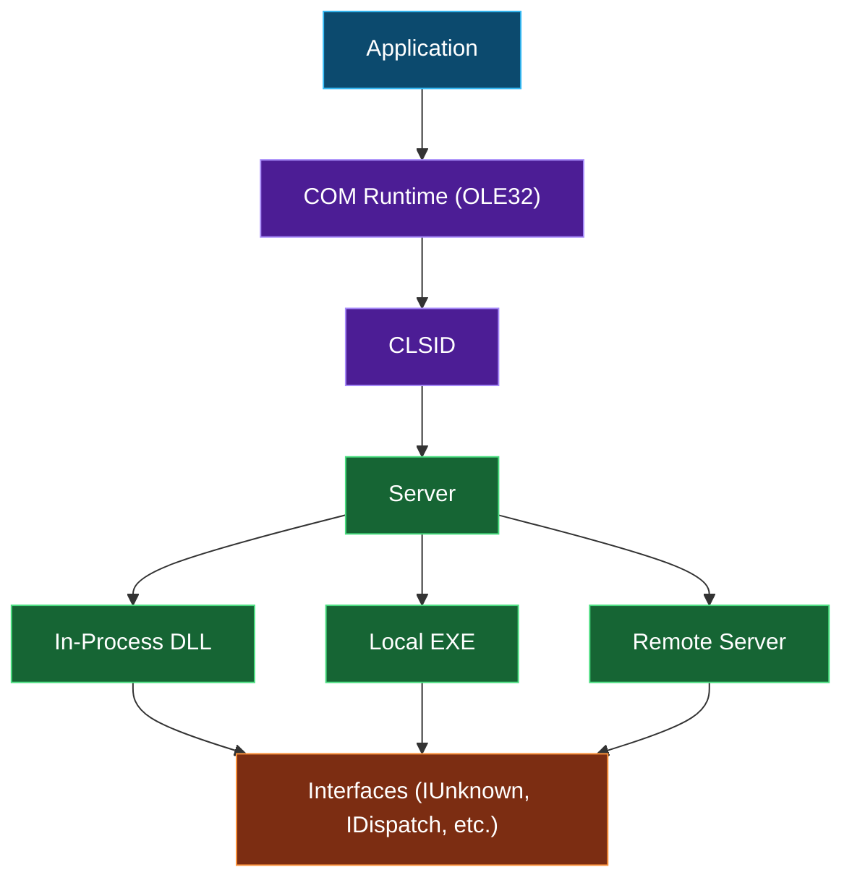
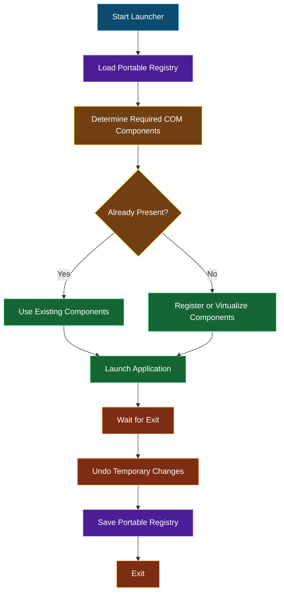

# Component Object Model (COM)

## Overview

The **Component Object Model (COM)** is Microsoft's binary interface standard for enabling software 
components to communicate with one another regardless of the programming language they were written 
in. Introduced in the early 1990s, COM forms the foundation for many Windows technologies, including:

* OLE (Object Linking and Embedding)
* ActiveX
* Windows Shell extensions
* DirectShow
* Windows Management Instrumentation (WMI)
* Microsoft Office automation
* Internet Explorer extensions
* Numerous third-party applications

Unlike traditional DLLs that expose exported functions, COM objects expose one or more interfaces 
identified by globally unique identifiers (GUIDs).

---

## COM Architecture

A COM component consists of several pieces:



Every COM object implements the **IUnknown** interface, which provides:

```cpp
QueryInterface()
AddRef()
Release()
```

Automation-compatible objects additionally expose **IDispatch**, allowing scripting languages 
such as VBScript, JScript, and PowerShell to invoke methods dynamically.

---

## COM Identifiers

### Registry Keys

Before we jump into registering files, we should better understand how the `HKEY_CLASSES_ROOT` 
(`HKCR`) Registry tree works. Bare with me but the `HKCR` root doesn't technically exist; it is 
a shortcut to other sections of the Registry filesystem. On Windows NT 4.0 or earlier, `HKCR` 
only points to `HKEY_LOCAL_MACHINE` (`HKLM`) `\SOFTWARE\Classes`. On Windows 2000 and later, 
there may also be `HKEY_CURRENT_USER` (`HKCU`) `\SOFTWARE\Classes` entries which override the 
`HKLM` ones; these are created when the user installs (or is "assigned") an application but does 
not have the rights to install it for all users (in `HKLM\SOFTWARE\Classes`). In the following 
notes I will use `HKCR` as the base of the Registry keys, but please understand that this most 
often (and best) refers to `HKLM\SOFTARE\Classes\`

### `GUIDs`/`CLSIDs`

A Class ID (`CLSID`), or class identifier, is a 128-bit (large) number expressed in hexadecimal 
surrounded by curly-brackets. They represent a unique ID for a program or application component. 
Think of a `CLSID` as a _social security number_ but for an application or its component. `CLSIDs` 
are used by Windows to identify software components without having to know their name. They can 
also be used by applications to identify a computer, file or other similar information. These IDs 
are generated by using the current time, network adapter address (if present), and other items on 
a computer so that no two numbers will ever be the same.

The registry entries for any registered component are usually located in the `HKEY_CLASSES_ROOT\CLSID` 
section of the registry. Each entry under `CLSID` is a subtree whose name is the curly-bracketed 
`GUID`?`GUIDs` are used to identify components and interfaces in the form of class IDs (`CLSID`) and 
interface IDs (`IID`). You can find out more by visiting this [article](https://msdn.microsoft.com/en-us/library/windows/desktop/ms691424(v=vs.85).aspx "CLSID Key (COM)"). 
(i.e. `HKCR\CLSID\{00000000-0000-0000-0000-000000000000}`). If a component has been properly registered, 
it will have a subtree underneath this called `InProcServer32`. The default value of the `InProcServer32` 
subtree is the full path to the component which corresponds to that `GUID`. This value may be one of 
two types; `REG_SZ` or `REG_EXPAND_SZ`. If its `REG_EXPAND_SZ`, the path will typically contain an 
environment variable such as `%SYSTEMROOT%` in the path name.

> [!NOTE]
> A developer has full control over what happens when you call RegSvr32. Usually they will register 
COM controls in HKCR, but they don't have to. They can do whatever they feel like doing and there's 
no absolute way for you to tell whether they've done it or not.

One of the following values must exist to instruct the system where to find the component:

 - `HKCR\CLSID\_{CLSID}_\LocalServer` = full path to 16-bit file
 - `HKCR\CLSID\_{CLSID}_\LocalServer32` = full path to 32-bit file
 - `HKCR\CLSID\_{CLSID}_\InprocServer` = full path to 16-bit file
 - `HKCR\CLSID\_{CLSID}_\InprocServer32` = full path to 32-bit file

Other optional values include:

 - `HKCR\CLSID\_{CLSID}_\(default)` = human-readable class name
 - `HKCR\CLSID\_{CLSID}_\DefaultIcon` = path to file/icon index
 - `HKCR\CLSID\_{CLSID}_\Insertable`
 - `HKCR\CLSID\_{CLSID}_\Interface`
 - `HKCR\CLSID\_{CLSID}_\ProgID` = _ProgID_


### `ProgID`

 - `HKCR\_ProgID_\`
 - `HKCR\_ProgID_\(default)` = human readable component name
 - `HKCR\_ProgID_\CLSID\(default)` = `CLSID`
 - `HKCR\_ProgID_\...`

There are also version-independent program ID's with the format _Program_._Component_, as follows:

 - `HKCR\_Versionless-ProgID_\`
 - `HKCR\_Versionless-ProgID_\CLSID\` = `CLSID`
 - `HKCR\_Versionless-ProgID_\CurVer` = `ProgID`

### File Associations 

The File Extension assists the OS in knowing which program to run when you open a document with that extension by referring documents of a certain file extension to the appropriate `ProgID`. For example, when you double-click a Word `*.doc` file, the system looks up the extension `*.doc` and finds the reference to the _ProgID_ `Word.Document.8` where it can find the full path to the executable program `msword.exe`.

 - `HKCR\CLSID\_.ext_\(default)` = `ProgID`

### Interface

If the component needs to register an interface, it requires the following syntax:

 - `HKCR\Interface\_IID_\`
 - `HKCR\Interface\_IID_\BaseInterface`
 - `HKCR\Interface\_IID_\NumMethods`
 - `HKCR\Interface\_IID_\ProxyStubCLSID` or `ProxyStubCLSID32` = `CLSID`

### AppID

Some EXE components group their registration information together with other related components, under a single AppID, as follows. The AppID is a string which looks like a filename, e.g. “MYAPP.EXE”.

 - `HKCR\AppID\_AppID_\`
 - `HKCR\AppID\_AppID_\AppID` = `AppID`
 - `HKCR\AppID\_AppID_\DllSurrogate` or `DllSurrogateExecutable` = path to file
 - `HKCR\AppID\_AppID_\LocalService` or `ServicePartameters`
 - `HKCR\AppID\_AppID_\...`

### TypeLib

Type Libraries are required by some COM objects and are included in a separate file with an extension of `*.tlb`. The following Registry keys are also set in this case:

 - `HKCR\Interface\_IID_\TypeLib\(default)` = `TypeLib`
 - `HKCR\TypeLib\_TypeLib_\_#.#_\_#_\win32\(default)` = path to `.tlb` file
 - `HKCR\TypeLib\_TypeLib_\...`

---

## COM in Portable Apps

Portable applications aim to leave the host system unchanged after execution. COM presents one 
of the more challenging subsystems because many applications assume that required components 
are permanently registered in the Windows Registry.

A portable launcher should be able to recognize the component's self-registration entries and not 
just read in the values as registry keys which must be set during the importing of the portable 
application's settings, even if it has set the component to self-register as well.

### Implementation

Now that all that is out of the way we can focus on the fun stuff. If you need to register/unregister 
any component files you can do so a couple of ways. The first of which we'll be discussing is how 
to do so using the _Regsvr32_ command line. Windows PCs with Internet Explorer 3.0 or later have 
`Regsvr32.exe`. So trust me when I say there's a good chance your PC came stock with this. If you are 
running on a x64 computer, there are two variants you can consider. They can be found in either 
`$WINDIR\system32` or in `$WINDIR\SysWow32`.

The parameters you can use with RegSrv32 are `/u` `/s` `/i` `/n`. The `/u` command switch will unregister 
the file. The `/i` switch can be used with `/u` to call for DLL uninstallation. The `/n` parameter will 
not call _DllRegisterServer_; it's used with `/i` which is the install switch. If you use `/s`, which 
means silent, no message boxes will be displayed on Windows XP or later.

When using `Regsvr32.exe` from the command line you'll get a dialog box after calling it. The 
_DllSelfRegister_ function will be invoked unless using the aforementioned switch of course; if 
successful an alert box will be shown denoting it's success—as the same for failure which throws an 
error message.

That's just my opinion but you may use what works for you.

#### In the `Custom.nsh` File

```
;= Regardless of bit depth we're only using following:
!define REGSVR      `$SYSDIR\regsvr32.exe`                         ;= define where RegSrv32 is
!define DLL         `$AppDirectory\App\MyLegalProgram\myLegit.dll` ;= define the file to register

;= Command line usage is the same for both variants of RegSrv32 as follows
;= regsvr32 [/u] [/s] [/n] [/i[:cmdline]] DLL
Exec `"${REGSVR}" /s "${DLL}"`	                                    ;= notice the lack of the /i switch
                                                                    ;= That's because we aren't actually installing it

;= Additionally you may also use the following
ExecWait `"${REGSVR}" /s "${DLL}"` $0                               ;= The $0 will contain the error code if any
                                                                    ;= This will wait for exe to quit it's process before continuing
```

---

## Challenges

Some COM components are difficult or impossible to portablize because they depend on system-level integration.

Examples include:

* Shell extensions
* Explorer context menu handlers
* Thumbnail providers
* Browser Helper Objects (BHOs)
* Windows services exposed through COM
* Device drivers
* System-wide COM proxies
* Components installed into WinSxS with additional dependencies

These typically require installation or elevated privileges and are not suitable for fully portable operation.

---

## Best Practices

When designing a portable launcher:

* Prefer Registration-Free COM whenever possible.
* Detect whether required components are already present.
* Avoid overwriting existing system registrations.
* Back up any registry keys before making changes.
* Restore the original registry state on exit.
* Handle crashes gracefully to prevent orphaned registrations.
* Keep all application-specific COM components within the portable directory.
* Minimize administrative privilege requirements.

---

## Detecting COM Dependencies

Useful tools include:

* **Process Monitor (ProcMon)** — Monitor registry and file access during COM activation.
* **OLE/COM Object Viewer (OleView)** — Inspect registered COM classes, interfaces, and type libraries.
* **Dependency Walker** or **Dependencies** — Analyze imported libraries (note that COM activation itself is often
dynamic and may not appear as a direct DLL dependency).
* **Registry comparison tools** — Compare system state before and after installation to identify COM registrations.

Personally, I use a little tool called [RegDLLView](https://github.com/daemondevin/pac-man/wiki/Tools-of-the-Trade#regdllview "RegDLLView") 
by NirSoft. This makes finding the `GUID`, `ProgID`, and `CLSID` ridiculously easy.

### In the `Launcher.ini` File

With **Pac-Man**, all you will need is the `ProgID` and the file path of the DLL(s) that 
need registering. If you haven't already done so, grab both variants of [RegDLLView](https://github.com/daemondevin/pac-man/wiki/Tools-of-the-Trade#regdllview "RegDLLView") 
(x32 & x64—if you do not have a 64-bit machine do not worry about it but you're obviously limited to only 
building 32-bit compliant PAFs). Once you've got _RegDLLView_, go on and launch the 64-bit version (don't 
worry about trash or clean up.. _RegDLLView_ is completely portable by itself) and wait for it to finish 
loading (refer to the bottom, left corner of the window; you should see something like, _"Loading..."_). 
Once it's all loaded, look for the column `Last Registered On` in the top window pane and click on it until 
the list is sorted to the most recent date.

Now you can look for your applications DLL files. Scan for your application's company name. If there isn't 
anything for your application then close out _RegDLLView_ and open the 32-bit version and repeat the previous 
steps. If you do find something (there can be more than one) that relates to your application, refer to the 
file path column and locate that DLL. If the DLL's location is inside the application folder then no further 
action is required on your part because the DLL will be in the `%PAL:AppDir%\AppName` folder anyway. However, 
if the DLL is not located in the application folder and it is somewhere like `$SYSDIR\DynamicLibrary.dll` 
than you're going to need to copy the DLL into your PAF's folder (i.e. `..\App\DefaultData` so you can access 
them from `..\%PAL:DataDir%` as well as have a back up if needed later).

After you've copied the DLL you can now select the DLL reference in the top window pane of _RegDLLView_. 
Notice in the bottom window pane there is now one or more lines of data in regards to this DLL file. You'll 
only need the first line as this is where you can find the `ProgID` and that is what we want! Now in the 
`Launcher.ini` you just need the `ProgID` and the file path to the DLL(s) you want to register before launching 
the actual application. So you can now add the section `[RegesterDLL1]` and `[RegesterDLL2]` and so on depending 
on how many you might need. Your `Launcher.ini` file should have something similar to this:

```
[RegisterDLL1]
ProgID=MyAppControlPanel
File=%PAL:AppDir%\controller.cpl

[RegisterDLL2]
ProgID=DynamicLibrary
File=%PAL:DataDir%\dynlib.dll
```

---

## Typical Portable Launcher Workflow



---

## Summary

COM is a foundational Windows technology used by countless applications and system components. While traditional COM 
relies on persistent Registry registration, modern techniques such as Registration-Free COM, activation contexts, and 
registry virtualization enable many COM-dependent applications to operate portably.

For portable app frameworks, COM support generally falls into four categories:

| Technique               | Registry Changes | Cleanup Required | Portability |
| ----------------------- | ---------------: | ---------------: | ----------: |
| Registration-Free COM   |               No |               No |   Excellent |
| Temporary Registration  |              Yes |              Yes |        Good |
| Registry Virtualization |     Virtual Only |        Automatic |   Excellent |
| Permanent Installation  |              Yes |               No |        Poor |

A robust portable launcher should favor registration-free techniques where available, virtualize registry state when 
necessary, and ensure that any temporary registrations are reliably cleaned up, even in the event of unexpected 
application termination.
