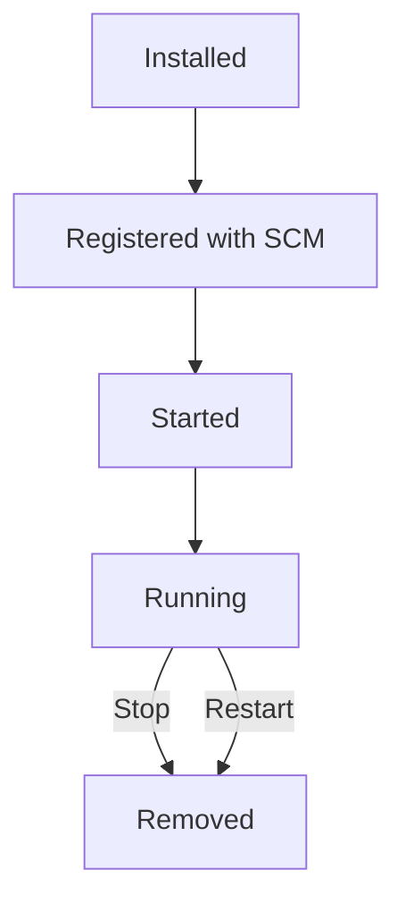
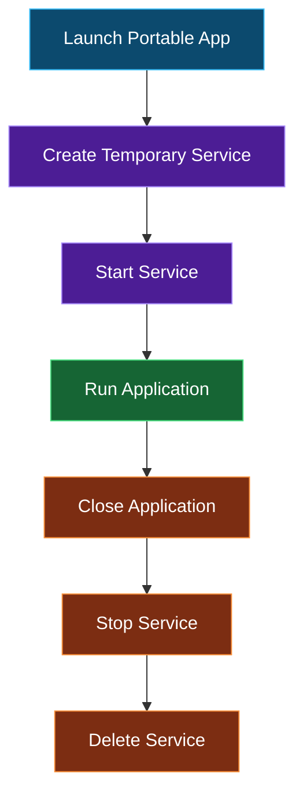
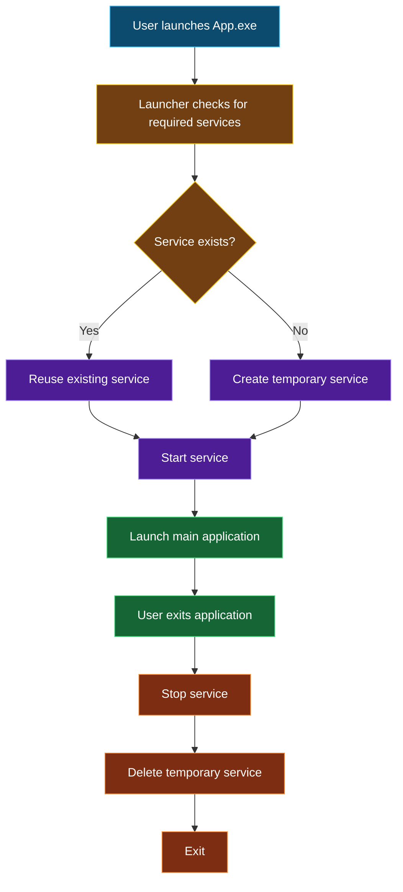

# Windows Services

## Overview

A **Windows Service** is a long-running executable that operates independently of a user's 
login session. Unlike traditional desktop applications, services are managed by the **Windows 
Service Control Manager (SCM)** and can start automatically when Windows boots, run in the 
background without a user interface, and continue operating even when no users are logged in.

Services are commonly used for tasks such as:

* Web servers
* Database servers
* Network monitoring
* File synchronization
* Scheduled background processing
* Device communication
* System monitoring
* Security software

Because they are managed by Windows itself, services provide a reliable mechanism for continuously 
running software.

---

## How Windows Services Work

Every Windows service has several properties managed by the Service Control Manager.

| Property     | Description                             |
| ------------ | --------------------------------------- |
| Service Name | Internal unique identifier              |
| Display Name | Friendly name shown in Services.msc     |
| Executable   | Program launched by Windows             |
| Startup Type | Automatic, Manual, Disabled, Delayed    |
| Account      | User account the service runs under     |
| Dependencies | Other services required before starting |

Typical lifecycle:


---

## Services in Portable Apps

Traditional Windows services conflict with portability because they typically require:

* Administrator privileges
* Registration with the Service Control Manager
* Registry entries
* Persistent installation
* Manual removal

Most portable launchers, like the ones created by _PortableApps.com Launcher_, intentionally avoid 
supporting services because they violate portability or introduce significant complexity.

However, some software **cannot function without background services**, making service support 
necessary in some portable apps.

Examples include:

* Local web servers
* Database engines
* Local AI models
* VPN software
* Backup utilities
* Remote access software
* Network proxies

---

## Pac-Man's Service Strategy

When updating an installation, it's good practice for you to stop the application, or _kill_ the app process, 
before overwriting any of its data. The same goes for portable apps. Since you're essentially _installing_ the 
portable app every time you launch it, we need to be sure that a locally run service (if any) is stopped before 
executing a portable version then return the host back to the service it was running on exit (if any).

A portable launcher can temporarily install services. The basic workflow looks like this:



This leaves the host machine in the same state it was before the application was launched.

---

## Administrator Privileges

Creating or deleting Windows services generally requires administrative privileges.

A portable launcher should:

* Detect whether elevation is required.
* Prompt only when necessary.
* Continue normally when no services are needed.

> [!IMPORTANT]
> Applications that never use services should never trigger a UAC prompt.

---

## Detecting Existing Services

Some applications may already have their services installed.

Before creating a temporary service, the launcher should determine whether the service already exists.

Possible outcomes:

| Situation                  | Action                   |
| -------------------------- | ------------------------ |
| Service already installed  | Reuse existing service   |
| Service exists but stopped | Start it                 |
| Service missing            | Create temporary service |
| Temporary service created  | Remove it on exit        |

This prevents interfering with software already installed on the host's machine.

### Finding Services

The easiest way to identify required services is to install the application inside a virtual machine 
or sandbox. You will need to _"capture"_ the installation of the app you're trying to portabilize. Using 
software like _Total Uninstall_ can make this process a lot easier but if you do not have the ability to 
use software, here's what you should do.

#### Step 1

Before installing the app in a sandboxed environment, you should export the current list of services
made available on the machine.

##### Using PowerShell

To export a list of services using PowerShell, use the following:

```powershell
Windows PowerShell
Copyright (C) Microsoft Corporation. All rights reserved.

Install the latest PowerShell for new features and improvements! https://aka.ms/PSWindows

PS C:\Users\daemondevin> Get-Service | Sort-Object Name > before.txt
```

##### Using CMD

To export a list of services using CMD, use the following:

```cmd
Microsoft Windows [Version 10.0.22621.4037]
(c) Microsoft Corporation. All rights reserved.

C:\Users\daemondevin>sc query type= service > before.txt
```

We're naming the output file `before.txt` because we'll do this again after the application is installed.

#### Step 2

##### Install App

Install the application and wait for it to finish.

> [!TIP]
> It would be wise not to do anything while installing an application you're trying to _capture_.
> You do not want to pollute the end results once done by adding or changing anything that could
> interfere with your snapshots.

#### Step 3

Repeat step 1 and export the services list again but this time name the file `after.txt`

#### Step 4

##### Compare Results

You could use software like `ExamDiff` or `Notepadd++` with the _ComparePlus_ plugin to get what's changed 
but if you have no access to such programs, here's what you could do.

###### Using PowerShell

```powershell
Compare-Object (Get-Content before.txt) (Get-Content after.txt)
```

This will show added and removed lines, but it won't compare service properties individually because the 
files contain plain text rather than PowerShell objects. If you want exhaustive comparison results, you 
could do the following using the `Export-Csv` cmdlet.

```powershell
Get-Service | Sort-Object Name | Export-Csv before.csv
```

Do the same for `after.csv` and compare the two snapshots by using:

```powershell
Compare-Object $before $after -Property Name | Where-Object SideIndicator -eq '=>'
```

This will find only newly added services.

> [!NOTE]
> Understanding the output  
> `<=` = Present only in before.csv (removed or changed)  
> `=>` = Present only in after.csv (added or changed)

#### Alternative Methods

Additional information can be gathered using:

- Services.msc
- Registry
- `HKLM\SYSTEM\CurrentControlSet\Services`
- Process Monitor
- Process Explorer
- Autoruns
- Windows Event Viewer

These tools reveal service names, executable paths, startup modes, dependencies, recovery options, 
and registry configuration.

---

### Services in `Launcher.ini`

Take note of the service name(s) that you find. Open Terminal or whatever command prompt of your 
choosing and enter `sc qc W32Time`. For the sake of this guide, I'm using the _Windows Time_ 
service which is called `W32Time` but replace `W32Time` with the name of your service. Repeat 
this for any other services you may find. After hitting enter, you should get something resembling 
the following:

```cmd
Microsoft Windows [Version 10.0.22621.4037]
(c) Microsoft Corporation. All rights reserved.

C:\Users\daemondevin>sc qc W32Time
[SC] QueryServiceConfig SUCCESS

SERVICE_NAME: W32Time
        TYPE               : 20  WIN32_SHARE_PROCESS
        START_TYPE         : 2   AUTO_START  (DELAYED)
        ERROR_CONTROL      : 1   NORMAL
        BINARY_PATH_NAME   : C:\Windows\system32\svchost.exe -k LocalService
        LOAD_ORDER_GROUP   :
        TAG                : 0
        DISPLAY_NAME       : Windows Time
        DEPENDENCIES       :
        SERVICE_START_NAME : NT AUTHORITY\LocalService

C:\Users\daemondevin>
```

So now you have all the information you need to deal with a service. What we would use from the above
output and how we'd add it to the `launcher.ini` file would be like this:

```ini
[Service1]
Name=W32Time
Path=%PAC:DataDir%\svchost.exe -k LocalService
Type=share
Start=auto
IfExists=skip
Description=Portable Windows Time service
```

Refer to the Wiki for [Windows Services Config Examples](https://github.com/daemondevin/pac-man/wiki/Windows-Services-Config-Examples) 
for an exhaustive list showing how to configure services with pac-man.

## Cleanup

Proper cleanup is essential.

When the portable application exits, the launcher should attempt to:

* Stop the service.
* Wait until it has stopped.
* Delete the service registration.
* Remove temporary files.
* Restore any modified settings.

If the application crashes unexpectedly, the launcher may attempt cleanup during the next launch.

---

## Advantages

Using temporary services provides several benefits.

* Preserves portability.
* Leaves no permanent installation.
* Supports applications requiring background services.
* Allows automatic cleanup.
* Minimizes changes to the host system.

---

## Limitations

Portable services are still subject to Windows security restrictions.

These include:

* Administrator rights may be required.
* Some services cannot be stopped immediately.
* Drivers cannot usually be installed temporarily.
* Certain enterprise security policies may block service creation.

---

## Best Practices

When implementing service support in a portable launcher:

* Install services only when required.
* Use manual startup.
* Detect existing installations first.
* Reuse existing services whenever possible.
* Remove temporary services during shutdown.
* Handle unexpected crashes gracefully.
* Log all service operations.
* Avoid modifying existing service configurations unless explicitly requested.

---

## Example Lifecycle



---

## Summary

Windows Services provide a robust mechanism for running software in the background, but their 
installation-based nature conflicts with the goals of portable applications. By creating services 
only when necessary, reusing existing installations, and removing temporary services during shutdown, 
portable launchers can support service-dependent software while maintaining a clean, self-contained 
user experience.

This approach combines the reliability of Windows Services with the portability expected from 
applications that are designed to leave minimal traces on the host system.
